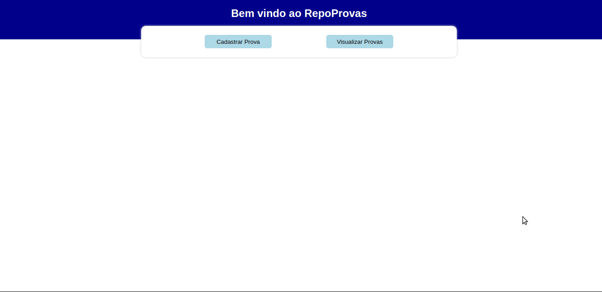

<h1 align="center">
    <a href="#"> RepoProvas 📚</a>
</h1>

<h4 align="center"> 
	 Status: In development
</h4>

<p align="center">
 <a href="#about">About</a> •
 <a href="#layout">Layout</a> • 
 <a href="#how-it-works">How it works</a> • 
 <a href="#pre-requisites">Pre-requisites</a> • 
 <a href="#tech-stack">Tech Stack</a> • 
 <a href="#how-to-contribute">How to contribute</a> • 
 <a href="#author">Author</a>
</p>

## About

Here you can register and find old proofs of the basic disciplines of engineering courses, enjoy!

---

## Layout

<div align="center">
 
</div>

This layout was completely made by me :)

---

## How it works

This project is divided into two parts:

1. Backend (You can find here: https://github.com/samuelfcf/repoprovas-back)
2. Frontend (This repository)

---

## Pre-requisites

Before you begin, you will need to have the following tools installed on your machine:
[Git](https://git-scm.com), [Node.js](https://nodejs.org/en/), [VSCode](https://code.visualstudio.com/).

### Running the Frontend

```bash

# Clone this repository
$ git clone https://github.com/samuelfcf/repoprovas-front

# Access the project folder cmd/terminal
$ cd repoprovas-front

# Install the dependencies
$ yarn install

# If you want to run your app on localhost, create a .env file with the environment variable pointing to your local server.

# Run the application in development mode
$ yarn start

# The server will start at port: 3000

```

You can find an .env.example <a href="https://github.com/samuelfcf/repoprovas-front/blob/main/.env.exemple">here</a>.

---

## Tech Stack

The following tools were used in the construction of the project:

**Frontend** ([React](https://reactjs.org/))

- **[Typescript](https://www.typescriptlang.org/)**
- **[Axios](https://github.com/axios/axios)**
- **[React-router-dom](https://github.com/remix-run/react-router)**
- **[Styled-components](https://github.com/styled-components/styled-components)**
- **[SweetAlert2](https://github.com/sweetalert2/sweetalert2)**
- **[Eslint - Airbnb](https://github.com/airbnb/javascript)**
- **[Prettier](https://github.com/prettier/prettier)**

> See the file [package.json](https://github.com/samuelfcf/repoprovas-front/blob/main/package.json)

---

## How to contribute

1. Fork the project.
2. Create a new branch with your changes: `git checkout -b feat/myFeatureName`
3. For each feature implemented, make a commit specifying what was done
4. Submit your changes: `git push -u origin feat/myFeatureName`

---

## Author

Developed with ❤️ by Samuel Felipe Castro Fernandes.
